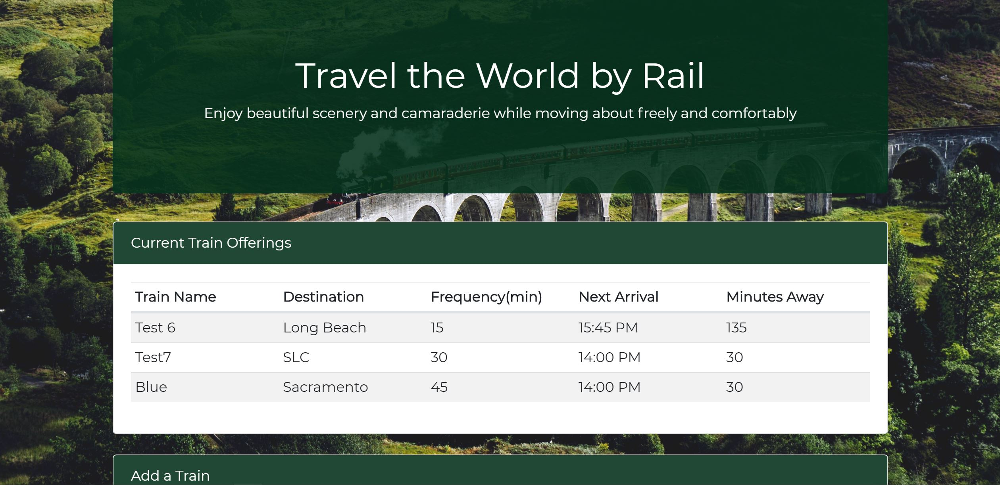

# Train-Scheduler
This is a front end application built with jQuery utilizing the Firebase database.

# How to use
Enter a train name, destinatation, initial travel time, and frequency of travel. Click submit and train will be added to the schedule.  You will then be able to see the minutes remaining until the next arrival time.

# Future enhancements
Auto refresh of the time remaining may be implemented in a future release

### [Try the App!](https://Edestiny7.github.io/Train-Scheduler/)

Technology: HTML5 | CSS3 | JavaScript | jQuery Bootstrap | Google Fonts | Firebase